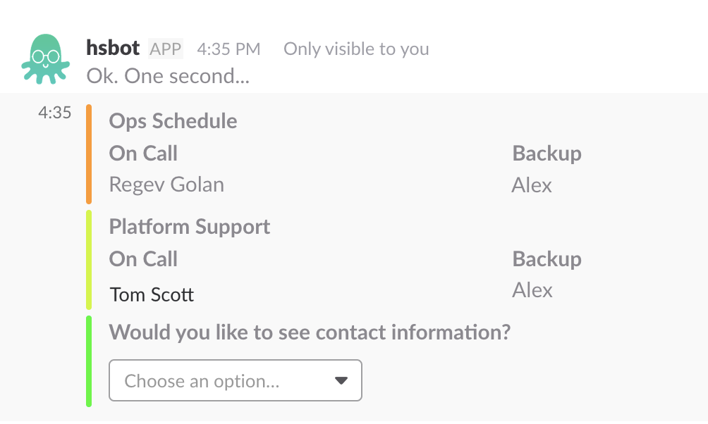
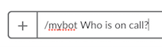

## Jesse Berliner-Sachs Slackbot

Slackbot with MongoDB and PagerDuty Integration

Originally developed for HiredScore Inc. by Jesse Berliner-Sachs
### Example

### All Functionality
* **help**
	* Displays all the possible commands and their use
* **oncall**
	* Displays who is currently on PagerDuty and their phone numbers
* **online (n , t[='second', 'minute', 'hour', 'day'])** 
	* Queryies MongoDB Database of user website actions
	* Displays the customers who have used the website in the past n seconds, miuntes, hours, or days
	* Arguments **n** and **t** are optional
	* Default **n** is 2 and default **t** is 'Minutes'
* **stats**
	* Displays statistics of which commands are used and by whom 
* **resetstats** 
	* resets usage statistics

### To Add/Edit Command
1. Build function to be called on command in
slackbot.py
	1. If your function takes other arguments define it as `def my_function(text):` Where `text` is the slack message which followed the key. Ensure in step 2.2 that `"params" : True`
	2. If your command should send a text response have `my_function` return the response as a string.
	3. For more complicated responses (images, attachments, buttons) return a dictionary representing the json as defined by the [Slack Message Builder Documentation](https://api.slack.com/docs/message-formatting)
2. Add dictionary to the 'COMMANDS' array  which includes:
	1. 'function': function_to\_be\_called
	2. "keys" : [List of strings which indication]
	3. "params" : bool ('True' if your function takes arguments)
	4. "calls" : 0 (counts the number of times your function is called)

